<h1 align="center">📈 GitHub Activity Metrics</h1>

  This profile is automatically updated every 24 hours with the latest GitHub statistics.

  

---

  
    Generated with <a href="https://github.com/lowlighter/metrics">lowlighter/metrics</a> – a GitHub Action for visualizing GitHub stats.
  

